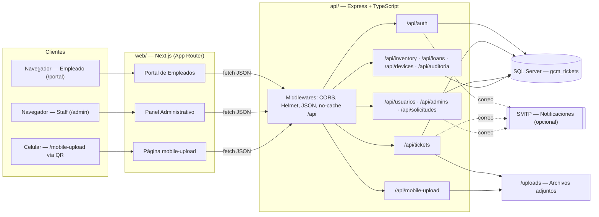
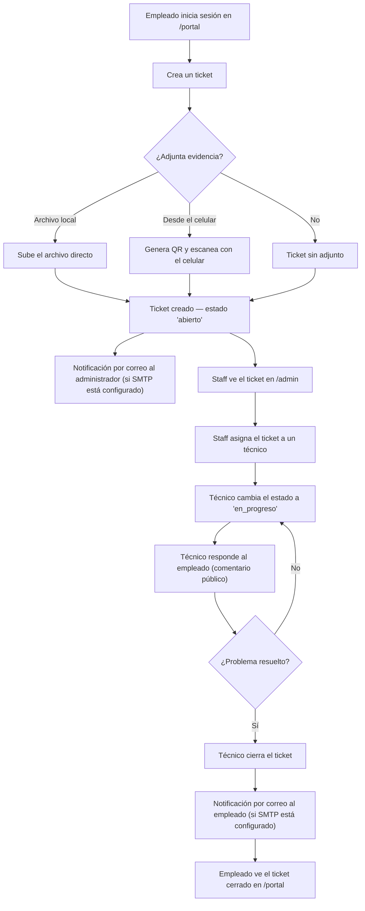
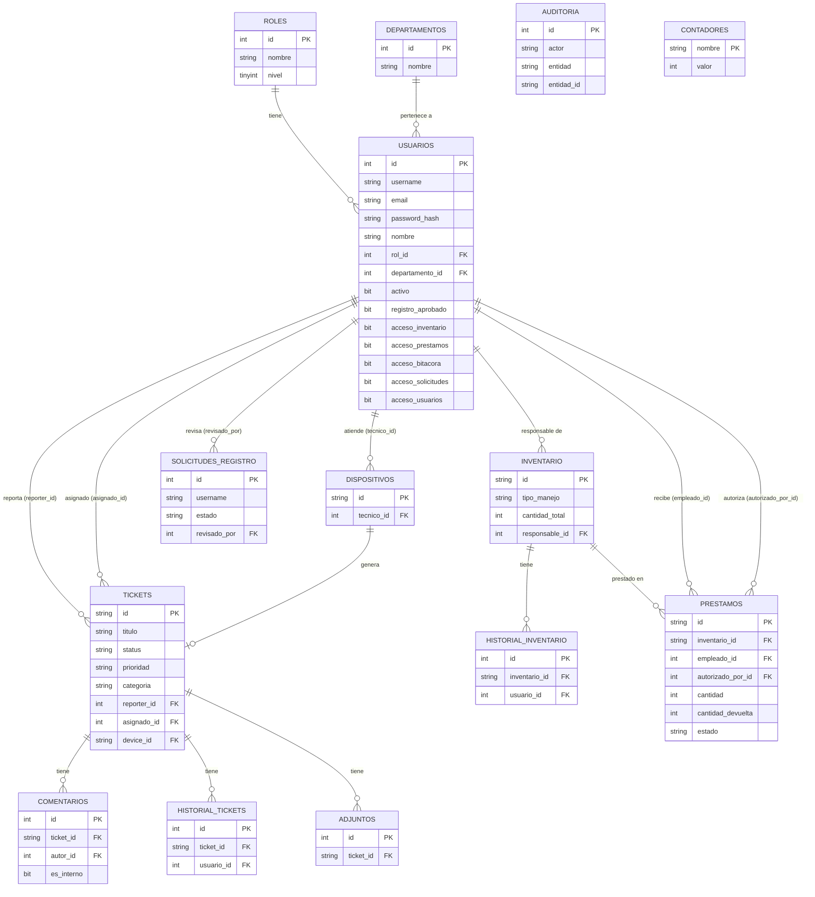

<div align="center">

# MANUAL TÉCNICO

## GCM Tickets
### Sistema de Soporte Técnico, Inventario y Préstamos

**Grupo Milcien S.A. de C.V.**
**Departamento de Sistemas / TI**

Versión del documento: 1.0
Fecha: Julio 2026
Clasificación: Uso interno

</div>

<div style="page-break-after: always;"></div>

## Tabla de contenido

1. [Introducción](#1-introducción)
2. [Objetivo del sistema](#2-objetivo-del-sistema)
3. [Alcance](#3-alcance)
4. [Arquitectura del sistema](#4-arquitectura-del-sistema)
5. [Tecnologías utilizadas](#5-tecnologías-utilizadas)
6. [Requisitos de software y hardware](#6-requisitos-de-software-y-hardware)
7. [Estructura del proyecto](#7-estructura-del-proyecto)
8. [Descripción de cada módulo](#8-descripción-de-cada-módulo)
9. [Flujo general del sistema](#9-flujo-general-del-sistema)
10. [Modelo de datos](#10-modelo-de-datos)
11. [Descripción de la base de datos](#11-descripción-de-la-base-de-datos)
12. [API REST](#12-api-rest)
13. [Variables de entorno](#13-variables-de-entorno)
14. [Autenticación y autorización](#14-autenticación-y-autorización)
15. [Validaciones implementadas](#15-validaciones-implementadas)
16. [Manejo de errores](#16-manejo-de-errores)
17. [Seguridad implementada](#17-seguridad-implementada)
18. [Librerías utilizadas](#18-librerías-utilizadas)
19. [Dependencias](#19-dependencias)
20. [Diagrama de arquitectura (Mermaid)](#20-diagrama-de-arquitectura-mermaid)
21. [Diagrama de flujo (Mermaid)](#21-diagrama-de-flujo-mermaid)
22. [Diagrama entidad-relación (Mermaid)](#22-diagrama-entidad-relación-mermaid)
23. [Procedimiento de instalación](#23-procedimiento-de-instalación)
24. [Configuración inicial](#24-configuración-inicial)
25. [Despliegue](#25-despliegue)
26. [Mantenimiento](#26-mantenimiento)
27. [Buenas prácticas](#27-buenas-prácticas)
28. [Posibles mejoras futuras](#28-posibles-mejoras-futuras)
29. [Conclusiones](#29-conclusiones)

<div style="page-break-after: always;"></div>

## 1. Introducción

**GCM Tickets** es un sistema interno desarrollado para **Grupo Milcien S.A. de C.V.** que centraliza la gestión de soporte técnico, el control de inventario de equipos y la administración de préstamos de equipo a empleados. El sistema está compuesto por dos aplicaciones Node.js independientes:

- **`api/`**: API REST construida con Express y TypeScript, con autenticación basada en JWT y persistencia en SQL Server.
- **`web/`**: aplicación cliente construida con Next.js (App Router), TypeScript y Tailwind CSS, que consume la API anterior.

Este manual técnico documenta la arquitectura, el modelo de datos, los contratos de la API, las medidas de seguridad y los procedimientos de instalación, despliegue y mantenimiento del sistema, con base en el análisis directo del código fuente del repositorio.

> **Nota metodológica:** todo el contenido de este documento se derivó de la inspección del código fuente (`api/` y `web/`), los scripts de base de datos (`schema.sql`, `procedimientos.sql`) y los scripts de operación (`start.bat`, `start-web.bat`, `ecosystem.config.js`, `setup-servidor.ps1`, `backup.ps1`). Donde no existe evidencia directa en el código, se indica explícitamente como **inferencia**.

## 2. Objetivo del sistema

Proveer una plataforma interna única donde:

- Los **empleados** puedan reportar incidencias de soporte técnico y darles seguimiento.
- El **personal de TI** (técnicos, administradores y superadministrador) pueda gestionar esas incidencias, administrar el inventario de equipos, controlar préstamos de equipo y auditar la actividad administrativa del sistema.
- Todo el acceso quede ligado a una cuenta de usuario autenticada, sin acciones anónimas ni campos de identidad de texto libre no verificado.

## 3. Alcance

**Incluido en el sistema (evidenciado en el código):**

- Registro de empleados (con aprobación manual por un administrador).
- Autenticación diferenciada para el portal de empleados y el panel administrativo.
- Gestión de tickets de soporte: creación, asignación, comentarios, notas internas, adjuntos, historial de cambios.
- Subida de evidencias desde el celular mediante código QR, sin necesidad de sesión en el dispositivo móvil.
- Gestión de inventario de equipos, en dos modalidades: por unidad (con número de serie) y por cantidad (lotes).
- Gestión de préstamos de equipo, con devoluciones totales o parciales y generación de comprobantes imprimibles (`.doc`).
- Gestión de usuarios y de solicitudes de registro, con permisos de acceso por módulo otorgados por un superadministrador.
- Bitácora de auditoría de acciones administrativas.
- Notificaciones por correo electrónico (opcionales, requieren configuración SMTP).
- Exportación de tickets a Excel.

**Fuera de alcance (no evidenciado en el código):**

- No existe recuperación de contraseña autoservicio (sin flujo de "olvidé mi contraseña" ni verificación de correo).
- No existe una app móvil nativa; el acceso desde celular es vía navegador web.
- No hay soporte multi-idioma (toda la interfaz está en español).
- No hay pruebas automatizadas (no se encontraron dependencias de testing en `package.json`).

## 4. Arquitectura del sistema

El sistema sigue una arquitectura **cliente-servidor** de dos capas desacopladas, comunicadas exclusivamente por HTTP/JSON:

| Capa | Proyecto | Responsabilidad |
|---|---|---|
| Presentación | `web/` (Next.js) | Renderiza el portal de empleados y el panel administrativo; consume la API vía `fetch`. |
| Aplicación / Datos | `api/` (Express) | Expone la API REST, aplica reglas de negocio, autenticación y autorización, y accede a SQL Server. |
| Persistencia | SQL Server | Almacena todos los datos de negocio mediante tablas y stored procedures. |

Puntos clave de la arquitectura:

- **Sin servidor de sesión**: la autenticación es *stateless* mediante JWT firmado (HS256), transportado en el header `Authorization: Bearer <token>`. El backend no mantiene sesiones en memoria para usuarios autenticados.
- **CORS abierto por diseño**: el backend acepta peticiones de cualquier origen (`cors({ origin: true })`), porque el frontend se accede desde distintas IPs de la red local (incluyendo el celular que escanea el código QR). La seguridad de acceso recae en el JWT, no en el origen de la petición.
- **Acceso a datos centralizado**: todos los módulos de rutas usan el módulo `api/src/db.ts` como única puerta de acceso a SQL Server, ya sea mediante stored procedures (`db.exec`/`db.execOne`) o queries parametrizadas inline (`db.query`/`db.queryOne`).
- **Sesiones móviles efímeras en memoria**: el flujo de "subir desde el celular" (evidencias de tickets y fotos de inventario) usa un `Map` en memoria (`api/src/mobileSessions.ts`) con un token aleatorio y una expiración de 5 minutos; no requiere autenticación del dispositivo móvil.
- **Notificaciones síncronas**: los correos se envían de forma "best-effort" en el mismo ciclo de la petición HTTP que origina el evento (nuevo ticket, cambio de estado, nueva solicitud); un fallo de envío se registra en consola pero no interrumpe la respuesta al cliente.

## 5. Tecnologías utilizadas

### 5.1 Backend (`api/`)

| Tecnología | Rol en el sistema |
|---|---|
| Node.js | Entorno de ejecución |
| Express 4 | Framework HTTP y enrutamiento |
| TypeScript | Tipado estático; se compila a `dist/` para producción |
| SQL Server | Motor de base de datos relacional |
| mssql (driver) | Conexión y ejecución de queries/stored procedures contra SQL Server |
| JSON Web Tokens (JWT) | Emisión y verificación de la sesión de usuario |
| bcrypt | Hashing de contraseñas |
| Helmet | Cabeceras HTTP de seguridad |
| CORS | Habilitación de peticiones cross-origin |
| express-rate-limit | Límite de intentos en login y registro |
| Multer | Procesamiento de subidas `multipart/form-data` |
| Nodemailer | Envío de correos SMTP |
| qrcode | Generación de imágenes QR (PNG) |

### 5.2 Frontend (`web/`)

| Tecnología | Rol en el sistema |
|---|---|
| Next.js (App Router) | Framework de React; enrutamiento por sistema de archivos, renderizado en cliente para las páginas de la aplicación |
| React | Construcción de interfaces de usuario |
| TypeScript | Tipado estático compartido con las formas de datos de la API |
| Tailwind CSS | Sistema de estilos utilitario |
| SWR | Obtención de datos con cache, revalidación y `refreshInterval` (polling) |
| Chart.js / react-chartjs-2 | Gráficos de dona, barras y pastel del panel administrativo |
| Tabler Icons | Iconografía de la interfaz |
| xlsx (SheetJS) | Exportación del listado de tickets a Excel |
| clsx | Composición condicional de clases CSS |

## 6. Requisitos de software y hardware

### 6.1 Software (servidor)

| Requisito | Versión mínima |
|---|---|
| Sistema operativo | Windows (los scripts de arranque son `.bat`/`.ps1`) |
| Node.js | v18 o superior |
| SQL Server | 2014 o superior (Express es suficiente) |
| PM2 (opcional, producción) | Última versión estable, instalado globalmente vía npm |

### 6.2 Software (cliente)

- Navegador web moderno con soporte de JavaScript (Chrome, Edge, Firefox).
- Para el flujo de subida por QR: un celular con cámara y navegador web, en la misma red local que el servidor.

### 6.3 Hardware (inferencia razonable, no hay especificación explícita en el código)

No se documentan requisitos de hardware exactos en el repositorio. Como referencia general para un sistema de este tamaño (aplicación Node.js + SQL Server para una organización, no para tráfico masivo):

| Componente | Recomendación orientativa |
|---|---|
| CPU | 2 núcleos o más |
| RAM | 4 GB mínimo, 8 GB recomendado (compartido con SQL Server) |
| Almacenamiento | Depende del volumen de adjuntos subidos (`api/uploads/`) y del crecimiento de la base de datos |
| Red | Conectividad LAN estable entre el servidor y los equipos/celulares que acceden al sistema |

## 7. Estructura del proyecto

```
SistemaAPP/
├── start.bat                  — Arranque manual del backend (Windows)
├── start-web.bat              — Arranque manual del frontend (Windows)
├── abrir-app.bat              — Abre /admin en el navegador al iniciar sesión de Windows
├── ecosystem.config.js        — Configuración de PM2 (backend + frontend) para producción
├── setup-servidor.ps1         — Instalación como servicio permanente (Windows Server)
├── backup.ps1                 — Backup diario de BD + uploads
│
├── api/                       — API (Express + TypeScript + JWT)
│   ├── server.ts              — Punto de entrada: middlewares, montaje de rutas, arranque
│   ├── setup.js                — Configura la BD (tablas, SPs, usuario admin inicial)
│   ├── schema.sql              — Tablas, roles, seeds y migraciones idempotentes
│   ├── procedimientos.sql      — Stored procedures
│   ├── .env / .env.example     — Configuración (BD, JWT, SMTP, puertos)
│   ├── uploads/                 — Adjuntos subidos (no versionado en git)
│   └── src/
│       ├── db.ts               — Pool de conexión y helpers de acceso a datos
│       ├── config.ts           — Constantes de configuración desde .env
│       ├── helpers.ts           — Formato de fechas, IP local, URL pública, auditoría
│       ├── ticketLoader.ts      — Ensamblado de la forma completa de un Ticket
│       ├── mobileSessions.ts    — Sesiones efímeras de subida desde celular
│       ├── mailer.ts            — Plantillas y envío de notificaciones por correo
│       ├── types.ts             — Tipos compartidos del backend
│       ├── middleware/
│       │   ├── auth.ts          — Verificación de JWT y permisos por rol/módulo
│       │   └── upload.ts        — Configuración de Multer
│       └── routes/
│           ├── auth.ts          — Login y registro
│           ├── tickets.ts       — CRUD de tickets, comentarios, notas, adjuntos
│           ├── usuarios.ts      — Usuarios, solicitudes de acceso, permisos
│           ├── inventory.ts     — Inventario, préstamos, dispositivos, bitácora
│           └── mobileUpload.ts  — Adjuntos desde celular vía QR
│
└── web/                        — Frontend (Next.js + TypeScript + Tailwind)
    ├── app/
    │   ├── page.tsx             — Redirección raíz → /portal
    │   ├── layout.tsx           — Layout raíz (fuente, script anti-FOUC)
    │   ├── portal/               — Portal de empleados
    │   │   └── _components/      — Header, Hero, IdentScreen, TicketCard, NewTicketModal, QRModal
    │   ├── admin/                — Panel TI / administración
    │   │   ├── _components/      — Header, LoginScreen, TicketList, DetailDrawer, gráficos, notificaciones…
    │   │   ├── inventario/       — Equipos, préstamos, responsables
    │   │   ├── usuarios/         — Gestión de usuarios y solicitudes de acceso
    │   │   └── auditoria/        — Bitácora del sistema
    │   ├── registro/             — Solicitud de acceso (alta de empleado)
    │   └── mobile-upload/        — Página que recibe la subida desde el celular
    ├── components/ui/            — Componentes compartidos (Modal, Toast, Tabs, Autocomplete…)
    └── lib/                      — Cliente API, autenticación, tipos, tema, utilidades
```

## 8. Descripción de cada módulo

### 8.1 Módulos del backend (`api/src/routes/*.ts`)

| Módulo | Prefijo | Responsabilidad |
|---|---|---|
| `auth.ts` | `/api/auth` | Autenticación (login) y alta de solicitudes de registro |
| `tickets.ts` | `/api/tickets` | Ciclo de vida completo del ticket: creación, consulta, edición, comentarios, notas internas, adjuntos |
| `usuarios.ts` | `/api` (`/usuarios`, `/admins`, `/solicitudes`) | Administración de cuentas, permisos de módulo y solicitudes de registro |
| `inventory.ts` | `/api` (`/devices`, `/inventory`, `/loans`, `/auditoria`) | Inventario de equipos, recepción de dispositivos externos, préstamos y bitácora |
| `mobileUpload.ts` | `/api/mobile-upload` | Flujo de subida de archivos desde el celular vía QR, sin autenticación |

### 8.2 Módulos de soporte del backend (`api/src/*.ts`)

| Módulo | Responsabilidad |
|---|---|
| `db.ts` | Pool de conexión a SQL Server; ejecución de queries inline y de stored procedures; generación de folios (`nextId`) |
| `config.ts` | Lectura y validación de variables de entorno críticas (rutas, puertos, secreto de sesión) |
| `helpers.ts` | Formato de fechas en español, detección de IP LAN, resolución de la URL pública del frontend, registro de auditoría |
| `ticketLoader.ts` | Ensambla la forma completa de un ticket (comentarios, notas, historial, adjuntos) a partir de las filas crudas de SQL Server |
| `mobileSessions.ts` | Estado en memoria de las sesiones de subida móvil, con limpieza periódica de sesiones vencidas |
| `mailer.ts` | Plantillas HTML y envío de las tres notificaciones del sistema (nueva solicitud, nuevo ticket, cambio de estado) |
| `middleware/auth.ts` | `requireAuth`, `requireRole`, `requireSuperadminOrAcceso` |
| `middleware/upload.ts` | Configuración de Multer (validación de extensión, límite de tamaño, nombres aleatorios) |

### 8.3 Módulos del frontend (`web/app/*`)

| Módulo | Ruta | Responsabilidad |
|---|---|---|
| Portal de empleados | `/portal` | Login de empleado, creación y seguimiento de tickets propios |
| Solicitud de acceso | `/registro` | Formulario de alta de cuenta, pendiente de aprobación |
| Subida móvil | `/mobile-upload` | Página abierta al escanear el QR; captura y envía la evidencia |
| Bandeja de tickets | `/admin` | Vista principal del panel: listado, filtros, estadísticas, gráficos, detalle de ticket |
| Inventario | `/admin/inventario` | Dashboard, equipos, préstamos y responsables |
| Usuarios | `/admin/usuarios` | Gestión de cuentas y solicitudes de registro |
| Bitácora | `/admin/auditoria` | Consulta de la auditoría del sistema |

### 8.4 Módulos compartidos del frontend (`web/lib/`, `web/components/ui/`)

| Módulo | Responsabilidad |
|---|---|
| `lib/api.ts` | Cliente HTTP hacia la API; resuelve la URL base dinámicamente y normaliza errores |
| `lib/auth.tsx` | Contextos de autenticación independientes para el panel admin y el portal (sesión en `sessionStorage`) |
| `lib/types.ts` | Espejo de los DTOs devueltos por la API |
| `lib/theme.ts` | Modo oscuro/claro persistido en `localStorage` |
| `components/ui/*` | Biblioteca de componentes compartidos: `Modal`, `Drawer`, `Toast`, `Confirm`, `Tabs`, `Autocomplete`, `FormField`, etc. |

## 9. Flujo general del sistema

El flujo principal del sistema —desde el inicio de sesión hasta la resolución de un ticket— se describe en detalle en la sección [21. Diagrama de flujo (Mermaid)](#21-diagrama-de-flujo-mermaid). En resumen:

1. El usuario inicia sesión desde `/portal` (empleado) o `/admin` (staff).
2. El backend valida credenciales, verifica que el rol corresponda al portal usado, y emite un JWT de 12 horas.
3. El empleado crea tickets y les da seguimiento; el staff los gestiona (asignación, estado, respuestas, notas internas).
4. En paralelo, el staff con los permisos otorgados administra inventario, préstamos, usuarios y consulta la bitácora.
5. Cada acción administrativa relevante queda registrada en la tabla `auditoria`.

## 10. Modelo de datos

El modelo de datos completo se presenta como diagrama entidad-relación en la sección [22](#22-diagrama-entidad-relación-mermaid). Las entidades principales son:

| Entidad | Descripción |
|---|---|
| `roles` | Catálogo de roles (`empleado`, `tecnico`, `admin`, `superadmin`), cada uno con un `nivel` numérico (1-4) |
| `departamentos` | Catálogo de departamentos de la empresa |
| `usuarios` | Cuentas de acceso (empleados y staff), con rol, departamento, estado y permisos de módulo |
| `tickets` | Solicitudes de soporte técnico |
| `comentarios` | Mensajes de un ticket, públicos o internos (`es_interno`) |
| `historial_tickets` | Bitácora de cambios de un ticket |
| `adjuntos` | Archivos adjuntos a un ticket |
| `dispositivos` | Equipos externos recibidos para reparación (generan un ticket asociado) |
| `inventario` | Equipos o lotes propios de la empresa |
| `historial_inventario` | Bitácora de cambios de un ítem de inventario |
| `prestamos` | Préstamos de inventario a empleados |
| `solicitudes_registro` | Solicitudes de alta de cuenta, pendientes de aprobación |
| `auditoria` | Bitácora general de acciones administrativas |
| `contadores` | Secuencias usadas para generar folios legibles (`TK-001`, `INV-001`, `PREST-001`, `DEV-001`) |

## 11. Descripción de la base de datos

- **Motor:** SQL Server 2014 o superior.
- **Nombre de la base de datos:** `gcm_tickets` (configurable vía `DB_NAME`).
- **Origen del esquema:** `api/schema.sql` (idempotente: usa `IF NOT EXISTS`/`IF OBJECT_ID` para poder ejecutarse varias veces sin pérdida de datos) y `api/procedimientos.sql` (20 stored procedures).
- **Convención de claves:** los catálogos pequeños (`roles`, `departamentos`, `contadores`) usan claves autoincrementales; las entidades de negocio (`tickets`, `inventario`, `prestamos`, `dispositivos`) usan folios legibles (`NVARCHAR`) generados por `db.nextId()`.
- **Columnas de respaldo `*_nombre`:** tablas como `tickets`, `comentarios` e `historial_tickets` conservan columnas de texto (`reporter_nombre`, `autor_nombre`, `usuario_nombre`) como respaldo de solo lectura para filas históricas que no pudieron resolverse a un usuario real; el backend actual siempre escribe también el `*_id` correspondiente.
- **Modo de manejo de inventario:** cada ítem de `inventario` tiene `tipo_manejo` = `'unidad'` (con número de serie, un solo préstamo a la vez) o `'cantidad'` (lote sin serie individual, con `cantidad_total` y préstamos parciales concurrentes).

### 11.1 Índice de stored procedures (`api/procedimientos.sql`)

| Categoría | Procedimientos |
|---|---|
| Autenticación y registro | `sp_GetUserForLogin`, `sp_UpdateLastLogin`, `sp_InsertSolicitudRegistro`, `sp_GetSolicitudes`, `sp_AprobarSolicitud`, `sp_RechazarSolicitud` |
| Usuarios | `sp_GetUsuarios`, `sp_GetAdmins` |
| Tickets | `sp_GetTickets`, `sp_GetTicket`, `sp_GetComentarios`, `sp_GetHistorialTicket`, `sp_GetAdjuntos` |
| Dispositivos e inventario | `sp_GetDevices`, `sp_CrearDispositivoConTicket`, `sp_GetInventory`, `sp_GetLoans` |
| Catálogos y auditoría | `sp_GetDepartamentos`, `sp_LogAudit`, `sp_GetAuditoria` |

Los procedimientos que ejecutan operaciones de varios pasos (`sp_AprobarSolicitud`, `sp_RechazarSolicitud`, `sp_CrearDispositivoConTicket`) están envueltos en `BEGIN TRANSACTION` / `COMMIT` / `ROLLBACK`, y usan `THROW` con códigos de error personalizados (`50404` no encontrado, `50409` conflicto) que las rutas de Express interpretan explícitamente.

## 12. API REST

Todas las rutas están montadas bajo el prefijo `/api` (ver `api/server.ts`). La documentación exhaustiva de cada endpoint (parámetros, cuerpo de la petición, respuesta y códigos de estado) vive como comentarios TSDoc directamente sobre cada handler en `api/src/routes/*.ts`. A continuación, el resumen de contrato:

### 12.1 `/api/auth`

| Método | Endpoint | Auth | Descripción |
|---|---|---|---|
| POST | `/login` | Ninguna (rate-limited) | Autentica y emite un JWT de 12h |
| POST | `/register` | Ninguna (rate-limited) | Crea una solicitud de registro pendiente de aprobación |

### 12.2 `/api/tickets`

| Método | Endpoint | Auth | Descripción |
|---|---|---|---|
| GET | `/` | Sesión | Lista tickets (propios si es empleado, todos si es staff) |
| POST | `/` | Sesión | Crea un ticket |
| GET | `/:id` | Sesión | Consulta un ticket (404 si no es propio y no es staff) |
| PATCH | `/:id` | Staff (nivel ≥ 2) | Edita campos y registra el cambio en el historial |
| DELETE | `/:id` | Staff (nivel ≥ 2) | Elimina el ticket y sus adjuntos en disco |
| POST | `/:id/comments` | Sesión | Agrega un comentario visible para el empleado |
| POST | `/:id/notes` | Staff (nivel ≥ 2) | Agrega una nota interna |
| POST | `/:id/attachments` | Sesión | Sube un adjunto directo (`multipart/form-data`) |
| POST | `/:id/attachments/from-mobile` | Sesión | Asocia un adjunto subido desde el celular vía QR |

### 12.3 `/api` (usuarios, admins, solicitudes)

| Método | Endpoint | Auth | Descripción |
|---|---|---|---|
| GET | `/usuarios` | Superadmin o permiso `usuarios` | Lista usuarios con datos personales |
| GET | `/usuarios/:id/tickets` | Superadmin o permiso `usuarios` | Tickets reportados por un usuario |
| DELETE | `/usuarios/:id` | Nivel ≥ 3 | Elimina un usuario (desvincula referencias) |
| PATCH | `/usuarios/:id/password` | Superadmin (nivel ≥ 4) | Cambia la contraseña de otro usuario |
| PATCH | `/usuarios/:id/activo` | Nivel ≥ 3 | Activa/desactiva una cuenta |
| PATCH | `/usuarios/:id/permisos` | Superadmin (nivel ≥ 4) | Otorga/revoca permisos de módulo |
| GET | `/usuarios/lista` | Nivel ≥ 2 | Lista ligera para autocompletados |
| GET | `/admins` | Nivel ≥ 2 | Lista el personal del sistema |
| POST | `/admins` | Nivel ≥ 3 | Da de alta un usuario técnico |
| DELETE | `/admins/:username` | Nivel ≥ 3 | Desactiva un miembro del personal |
| GET | `/solicitudes` | Superadmin o permiso `solicitudes` | Lista solicitudes de registro |
| POST | `/solicitudes/:id/aprobar` | Superadmin o permiso `solicitudes` | Aprueba y crea la cuenta |
| POST | `/solicitudes/:id/rechazar` | Superadmin o permiso `solicitudes` | Rechaza la solicitud |

### 12.4 `/api` (inventario, préstamos, dispositivos, bitácora)

| Método | Endpoint | Auth | Descripción |
|---|---|---|---|
| GET / POST | `/devices` | Superadmin o permiso `inventario` | Dispositivos externos en taller (crea también un ticket) |
| GET / POST | `/inventory` | Superadmin o permiso `inventario` | Inventario de equipos propios |
| PATCH / DELETE | `/inventory/:id` | Superadmin o permiso `inventario` | Edita/elimina un equipo |
| GET / POST | `/loans` | Superadmin o permiso `prestamos` | Préstamos de equipo |
| PATCH | `/loans/:id` | Superadmin o permiso `prestamos` | Registra devolución total o parcial |
| GET | `/auditoria` | Superadmin o permiso `bitacora` | Consulta la bitácora con filtros |

### 12.5 `/api/mobile-upload` (sin autenticación, por diseño)

| Método | Endpoint | Descripción |
|---|---|---|
| POST | `/session` | Crea una sesión de subida efímera (5 min) |
| GET | `/qr/:token` | Genera el QR (PNG) hacia `/mobile-upload` |
| POST | `/:token` | Recibe el archivo subido desde el celular |
| GET | `/status/:token` | Consulta si el archivo ya llegó |

### 12.6 Convenciones de respuesta

- Todas las respuestas de error tienen la forma `{ "error": "mensaje" }`.
- Códigos de estado usados en todo el sistema: `200`, `201`, `400`, `401`, `403`, `404`, `409`, `410` (sesión móvil expirada), `429` (rate limit), `500`.

## 13. Variables de entorno

### 13.1 `api/.env`

| Variable | Requerida | Default | Descripción |
|---|---|---|---|
| `DB_SERVER` | Sí | — | Host de SQL Server |
| `DB_PORT` | No | `1433` | Puerto de SQL Server |
| `DB_USER` | No | `sa` | Usuario de SQL Server |
| `DB_PASSWORD` | **Sí** | — | Contraseña de SQL Server (el proceso no arranca sin ella) |
| `DB_NAME` | No | `gcm_tickets` | Nombre de la base de datos |
| `PORT` | No | `8080` | Puerto de la API |
| `NODE_ENV` | No | — | `production` en despliegue |
| `SESSION_SECRET` | **Sí** (mín. 32 caracteres) | — | Secreto de firma de los JWT |
| `BCRYPT_ROUNDS` | No | `12` | Costo de hashing de contraseñas |
| `ADMIN_PASSWORD` | No | `admin123` | Contraseña del usuario `admin` solo en su primera creación |
| `WEB_PORT` | No | `8081` | Puerto de `web/`, usado para armar URLs (QR, correos) |
| `WEB_APP_URL` | No | — (se infiere la IP LAN) | URL pública fija del frontend |
| `SMTP_HOST`, `SMTP_PORT`, `SMTP_SECURE`, `SMTP_USER`, `SMTP_PASS` | No | — | Credenciales SMTP; sin ellas, el envío de correos queda deshabilitado |
| `SMTP_FROM` | No | — | Remitente mostrado en los correos |
| `SMTP_CC` | No | — | Correos en copia, separados por coma |

### 13.2 `web/.env.local`

| Variable | Requerida | Default | Descripción |
|---|---|---|---|
| `NEXT_PUBLIC_API_URL` | No | — (se infiere del host actual) | Override explícito de la URL de la API |
| `NEXT_PUBLIC_API_PORT` | No | `8080` | Puerto de la API, debe coincidir con `PORT` en `api/.env` |
| `PORT` | No | `8081` | Puerto en el que Next.js escucha (debe inyectarse como variable de entorno real del proceso, no basta con `.env.local`) |

## 14. Autenticación y autorización

- **Autenticación:** `POST /api/auth/login` valida usuario/contraseña (bcrypt) y el campo `portal` del body contra el nivel de rol de la cuenta, para impedir que un empleado entre por `/admin` o que un miembro del staff entre por `/portal`. Emite un JWT (`HS256`, 12 horas) con `{ id, username, nombre, rol_nivel }`.
- **Transporte de la sesión:** header `Authorization: Bearer <token>`; el frontend lo guarda en `sessionStorage` (namespaces separados para admin y portal), no en cookies.
- **Verificación:** el middleware `requireAuth` (`api/src/middleware/auth.ts`) valida la firma y expiración del token en cada petición protegida y adjunta el usuario decodificado a `req.user`.
- **Autorización por rol:** `requireRole(minNivel)` exige un nivel mínimo (1 empleado, 2 técnico, 3 admin, 4 superadmin).
- **Autorización por módulo:** `requireSuperadminOrAcceso(modulo)` permite siempre al superadmin (nivel 4); para el resto, consulta en cada petición la columna `acceso_<modulo>` del usuario en la base de datos — **no confía en el JWT** para este permiso, de modo que una revocación de acceso surte efecto de inmediato sin esperar a que expire el token.
- **Reserva exclusiva del superadmin:** cambiar la contraseña de otro usuario (`PATCH /usuarios/:id/password`) y otorgar/revocar permisos de módulo (`PATCH /usuarios/:id/permisos`) están reservados al nivel 4, sin excepción por permisos de módulo.

## 15. Validaciones implementadas

| Ámbito | Validación |
|---|---|
| Registro/alta de técnico | `username`: 3-20 caracteres, letras/números/guión bajo (regex) |
| Registro | `email`: formato válido (regex) |
| Registro / cambio de contraseña | Contraseña: mínimo 6 caracteres |
| Registro | `finca`: debe pertenecer a la lista fija de fincas de la empresa (o `'No aplica'`) |
| Tickets | `status` ∈ {`abierto`, `en_progreso`, `cerrado`}; `prioridad` ∈ {`Baja`, `Media`, `Alta`, `Crítica`}; `categoria` ∈ {`Hardware`, `Software`, `Red`, `Acceso`, `Otro`} |
| Inventario | `condicion` ∈ {`nuevo`, `excelente`, `bueno`, `regular`, `danado`}; `estado` ∈ {`disponible`, `en_uso`, `en_prestamo`, `en_reparacion`, `de_baja`}; `tipoManejo` ∈ {`unidad`, `cantidad`} |
| Inventario (modo unidad) | Número de serie obligatorio |
| Inventario (modo cantidad) | `cantidadTotal` debe ser entero ≥ 1; al editar, no puede bajar por debajo de lo ya prestado |
| Préstamos | No se puede prestar un equipo (`unidad`) ya prestado; en modo `cantidad`, la cantidad solicitada no puede exceder el stock disponible |
| Devoluciones | La cantidad a devolver no puede exceder lo pendiente del préstamo |
| Adjuntos | Extensión de archivo en la lista blanca (`jpg, jpeg, png, gif, webp, mp4, mov, avi, webm, 3gp`); tamaño máximo 50 MB |
| Cuenta propia | Un usuario no puede eliminar ni desactivar su propia cuenta |
| Personal mínimo | No se puede desactivar al único administrador/técnico activo restante |

## 16. Manejo de errores

- Cada handler de ruta envuelve su lógica en `try/catch`; los errores no controlados se registran con `console.error` y responden `500` con `{ error: "..." }`.
- Los errores de negocio (validación, conflicto, no encontrado) se detectan explícitamente y responden con el código adecuado (`400`, `404`, `409`) antes de llegar a una excepción genérica.
- Los stored procedures transaccionales usan `THROW` con números personalizados (`50404`, `50409`) que las rutas de Express traducen a códigos HTTP específicos inspeccionando `err.number`.
- En el frontend, `lib/api.ts` centraliza el manejo de errores HTTP: normaliza cualquier respuesta no exitosa en una instancia de `ApiError` (con `status` y `message`), y emite un evento global (`gcm:unauthorized`) cuando la API responde `401`, al que cada `AuthProvider` se suscribe para cerrar la sesión automáticamente.
- Los envíos de correo están aislados en bloques `try/catch` independientes de la operación principal: un fallo de SMTP se registra en consola pero nunca hace fallar la respuesta al cliente.

## 17. Seguridad implementada

| Medida | Detalle |
|---|---|
| Hashing de contraseñas | `bcrypt`, con costo configurable (`BCRYPT_ROUNDS`, default 12) |
| Sesión | JWT firmado (HS256), 12 horas de validez, secreto validado (mínimo 32 caracteres) al arrancar el proceso |
| Cabeceras HTTP | `helmet`, con `contentSecurityPolicy` desactivado (la API no sirve HTML propio) y `crossOriginResourcePolicy: cross-origin` (para que el frontend, en otro origen, pueda cargar `/uploads`) |
| Fuerza bruta | `express-rate-limit`: login limitado a 10 intentos/15 min por IP (no cuenta éxitos); registro limitado a 10/hora por IP |
| Enumeración de cuentas | El login responde el mismo mensaje genérico si el usuario no existe, la contraseña es incorrecta o el portal usado no corresponde al rol de la cuenta |
| Enumeración de tickets ajenos | Un empleado que consulta un ticket que no es suyo recibe `404`, no `403`, para no confirmar la existencia del ticket |
| Path traversal en adjuntos | Los nombres de archivo en disco se generan con `crypto.randomBytes`, nunca a partir del nombre original ni de parámetros de la URL |
| Consultas SQL | Las queries inline usan parámetros posicionados (`?` → `@pN`), nunca interpolación directa de texto de usuario; los nombres de columna dinámicos (ej. permisos de módulo) provienen de una lista blanca fija en el código, no de un valor recibido del cliente |
| Revalidación de permisos de módulo | Se consulta la base de datos en cada request (no se confía en el JWT), de modo que una revocación de permiso surte efecto inmediato |
| SMTP | Uso recomendado de "Contraseña de aplicación" de Google en vez de la contraseña real de la cuenta de correo |

**Limitaciones de seguridad conocidas (ver también sección 28):** no existe mecanismo de revocación de JWT antes de su expiración natural (12h); cambiar la contraseña de un usuario no invalida los tokens ya emitidos.

## 18. Librerías utilizadas

Ver la tabla de tecnologías en la sección 5, que describe el propósito de cada librería principal tanto del backend como del frontend.

## 19. Dependencias

### 19.1 `api/package.json`

```json
"dependencies": {
  "bcrypt": "^6.0.0",
  "cors": "^2.8.6",
  "dotenv": "^16.6.1",
  "express": "^4.18.2",
  "express-rate-limit": "^8.5.2",
  "helmet": "^8.3.0",
  "jsonwebtoken": "^9.0.3",
  "mssql": "^12.5.5",
  "multer": "^2.1.1",
  "nodemailer": "^9.0.3",
  "qrcode": "^1.5.4"
}
```

Dependencias de desarrollo: tipos de TypeScript para cada librería anterior (`@types/*`), además de `tsx` (ejecución en desarrollo) y `typescript` (compilador).

### 19.2 `web/package.json`

```json
"dependencies": {
  "@tabler/icons-react": "^3.44.0",
  "chart.js": "^4.5.1",
  "clsx": "^2.1.1",
  "next": "16.2.10",
  "react": "19.2.4",
  "react-chartjs-2": "^5.3.1",
  "react-dom": "19.2.4",
  "swr": "^2.4.2",
  "xlsx": "^0.18.5"
}
```

Dependencias de desarrollo: `@tailwindcss/postcss`, `tailwindcss`, `eslint` + `eslint-config-next`, y los tipos de TypeScript (`@types/node`, `@types/react`, `@types/react-dom`).

## 20. Diagrama de arquitectura (Mermaid)



## 21. Diagrama de flujo (Mermaid)



## 22. Diagrama entidad-relación (Mermaid)



## 23. Procedimiento de instalación

1. Instalar los requisitos: Node.js v18+, SQL Server 2014+.
2. Clonar el repositorio.
3. Copiar `api/.env.example` a `api/.env` y completar, como mínimo, `DB_SERVER`, `DB_PASSWORD` y `SESSION_SECRET`.
4. Ejecutar `start.bat` (Windows): en la primera ejecución instala las dependencias de `api/` (`npm install`), crea la base de datos, tablas, roles, stored procedures y el usuario `admin` inicial (`node setup.js`), compila el backend (`npm run build`) y lo arranca (`node dist/server.js`).
5. Ejecutar `start-web.bat` en otra ventana: instala las dependencias de `web/`, compila (`next build`) y arranca (`next start`) en el puerto configurado (`WEB_PORT`).
6. Acceder a `http://localhost:8081/admin` (panel TI) o `http://localhost:8081/portal` (empleados), sustituyendo el puerto si se configuró uno distinto.

## 24. Configuración inicial

- **Usuario inicial:** `admin` / contraseña definida en `ADMIN_PASSWORD` (default `admin123`), rol `superadmin`. Solo se crea si el usuario `admin` no existe aún; ejecuciones posteriores de `setup.js` no lo modifican.
- **Permisos de módulo:** por defecto, únicamente el superadmin tiene acceso a Inventario, Préstamos, Bitácora, Solicitudes de registro y Usuarios registrados. Cualquier otro técnico/admin requiere que el superadmin le otorgue cada permiso individualmente desde el modal "Usuarios administradores" del panel admin.
- **Correo (opcional):** completar las variables `SMTP_*` en `api/.env` usando una Contraseña de aplicación de Google para activar las notificaciones.
- **Actualización de esquema:** tras recibir cambios en `schema.sql` o `procedimientos.sql`, ejecutar `cd api && npm run setup` y luego arrancar normalmente.

## 25. Despliegue

### 25.1 Uso manual (una sola máquina, arranque bajo demanda)

`start.bat` y `start-web.bat`, cada uno en su propia ventana de consola (ver sección 23).

### 25.2 Producción con PM2 (servicio persistente)

1. Compilar ambos proyectos (`npm run build` en `api/` y en `web/`).
2. Instalar PM2 globalmente.
3. Ajustar en `ecosystem.config.js` las rutas (`cwd`) al directorio real de despliegue y el `PORT` del proceso `gcm-tickets-web` (debe coincidir con `WEB_PORT` de `api/.env`).
4. Ejecutar `pm2 start ecosystem.config.js`.

`ecosystem.config.js` define dos procesos en modo `fork` (no `cluster`, ya que ni el backend ni Next.js están pensados para ejecutarse en modo cluster de Node): `gcm-tickets` (backend, `dist/server.js`) y `gcm-tickets-web` (frontend, arrancado directamente vía el binario de Next.js con `-H 0.0.0.0` para escuchar en todas las interfaces de red).

### 25.3 Windows Server como servicio permanente

`setup-servidor.ps1` automatiza: verificación de Node.js, instalación de PM2, arranque de ambos procesos vía PM2, y configuración para que el servicio sobreviva a reinicios del servidor. `abrir-app.bat` puede configurarse para abrir `/admin` en el navegador automáticamente al iniciar sesión de Windows, esperando a que el frontend responda antes de abrir la pestaña.

## 26. Mantenimiento

- **Respaldo:** `backup.ps1` genera un backup diario de la base de datos (`BACKUP DATABASE` vía `sqlcmd`) y, previsiblemente, de la carpeta `api/uploads/` (adjuntos), reteniendo los últimos 7 días (`$KeepDays`). Normalmente se programa como tarea diaria mediante el Programador de Tareas de Windows, configurado por `setup-servidor.ps1`.
- **Actualización de código:** `git pull` seguido de recompilar (`npm run build`) ambos proyectos y, si hubo cambios de esquema, `npm run setup` en `api/`.
- **Logs (PM2):** `error_file` y `out_file` configurados en `ecosystem.config.js` para cada proceso (`logs/error.log`, `logs/out.log`, `logs/web-error.log`, `logs/web-out.log`).
- **Contraseña del superadmin:** solo puede resetearse mediante `PATCH /usuarios/:id/password`, ejecutado por otro superadmin desde el panel; no existe recuperación autoservicio.

## 27. Buenas prácticas

Prácticas observadas de forma consistente en el código, y que se recomienda mantener en desarrollos futuros:

- Separación estricta entre lógica de acceso a datos (`db.ts`), reglas de negocio (rutas) y presentación (frontend).
- Cada operación multi-paso con impacto en la integridad de datos (aprobar solicitud, rechazar solicitud, crear dispositivo + ticket) se implementa como stored procedure transaccional, no como varias sentencias sueltas desde Node.
- Revalidación de permisos de módulo en cada request contra la base de datos, en vez de confiar ciegamente en el contenido del JWT.
- Mensajes de error genéricos en operaciones sensibles (login, consulta de tickets ajenos) para no filtrar información a un atacante.
- Componentes de UI reutilizables (`components/ui/`) para mantener consistencia visual y reducir duplicación en el frontend.
- Notificaciones por correo aisladas en bloques `try/catch` propios, para que un fallo de SMTP nunca degrade la funcionalidad principal.

## 28. Posibles mejoras futuras

- **Pruebas automatizadas:** no se encontraron dependencias de testing (`jest`, `vitest`, etc.) en ninguno de los dos `package.json`; se recomienda incorporar pruebas unitarias/integración, especialmente sobre las rutas de negocio crítico (préstamos, permisos).
- **Transaccionalidad de `DELETE /api/usuarios/:id`:** desvincula manualmente al usuario de ~9 tablas con sentencias `UPDATE` sueltas, sin envolver la operación en una transacción (a diferencia de los stored procedures de solicitudes). Migrarlo a un stored procedure transaccional eliminaría el riesgo de una desvinculación parcial ante un fallo a mitad de camino.
- **Unificar el acceso a datos:** algunas rutas (`tickets.ts`, `usuarios.ts`) aún arman SQL inline con sintaxis MySQL que se traduce a T-SQL en cada llamada (`db.ts` → `toTSQL`); migrar esas queries a stored procedures uniformaría el patrón de acceso a datos usado en el resto del sistema.
- **Revocación de sesión:** no existe lista de revocación de JWT ni invalidación server-side al cambiar una contraseña; un token robado sigue siendo válido hasta su expiración natural (12h).
- **Escalabilidad de sesiones móviles:** `mobileSessions.ts` vive en memoria del proceso; en un despliegue con más de una instancia o balanceo de carga, las sesiones de subida por QR se perderían al no ser compartidas entre procesos.
- **Duplicación de componentes:** `QRModal.tsx` (portal) y `QRPhotoModal.tsx` (admin/inventario) implementan la misma lógica de sesión/polling casi línea por línea; lo mismo ocurre entre `generateLoanWord.ts` y `generateReturnWord.ts`. Extraer la lógica común reduciría el mantenimiento futuro.
- **Recuperación de contraseña autoservicio:** actualmente solo el superadmin puede resetear la contraseña de otro usuario; un flujo de recuperación por correo reduciría la carga operativa sobre el superadmin.
- **Eliminar sentencia residual:** `api/procedimientos.sql` termina con un `select * from usuarios;` suelto que no forma parte de ningún procedimiento (aparente resto de depuración); es inofensivo (el resultado se descarta al ejecutarse como parte de `npm run setup`) pero conviene retirarlo.

## 29. Conclusiones

GCM Tickets es un sistema cohesivo y funcionalmente completo para las necesidades de soporte técnico e inventario de Grupo Milcien S.A. de C.V., construido con tecnologías modernas y ampliamente soportadas (Express, Next.js, SQL Server). La separación entre backend y frontend, el uso de JWT sin estado, la revalidación de permisos por módulo contra la base de datos, y el uso de stored procedures transaccionales para operaciones críticas reflejan decisiones de diseño deliberadas orientadas a la seguridad y la integridad de los datos. Las áreas de mejora identificadas (pruebas automatizadas, transaccionalidad de la eliminación de usuarios, duplicación de componentes) son incrementales y no comprometen la operación actual del sistema.

<div style="page-break-after: always;"></div>

*Fin del Manual Técnico — GCM Tickets v1.0*
