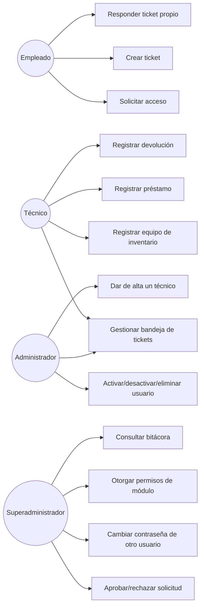
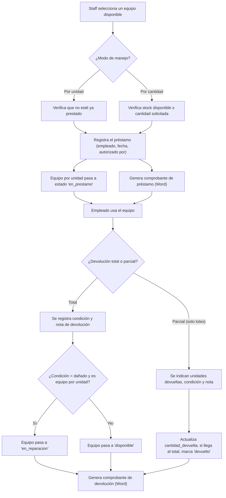

# DOCUMENTO FUNCIONAL

## GCM Tickets
### Sistema de Soporte Técnico, Inventario y Préstamos

**Grupo Milcien S.A. de C.V.**

Versión del documento: 1.0
Fecha: Julio 2026

## Tabla de contenido

1. [Objetivo del sistema](#1-objetivo-del-sistema)
2. [Problema que resuelve](#2-problema-que-resuelve)
3. [Usuarios del sistema](#3-usuarios-del-sistema)
4. [Roles](#4-roles)
5. [Casos de uso](#5-casos-de-uso)
6. [Reglas de negocio](#6-reglas-de-negocio)
7. [Funcionalidades principales](#7-funcionalidades-principales)
8. [Funcionalidades secundarias](#8-funcionalidades-secundarias)
9. [Flujo completo de cada proceso](#9-flujo-completo-de-cada-proceso)
10. [Restricciones](#10-restricciones)
11. [Validaciones](#11-validaciones)
12. [Escenarios de uso](#12-escenarios-de-uso)
13. [Requisitos funcionales](#13-requisitos-funcionales)
14. [Requisitos no funcionales](#14-requisitos-no-funcionales)

## 1. Objetivo del sistema

Centralizar, para Grupo Milcien S.A. de C.V., la gestión de:

1. Solicitudes de soporte técnico de los empleados.
2. El inventario de equipos tecnológicos propios de la empresa.
3. Los préstamos de dichos equipos a los empleados.
4. El alta y administración de cuentas de usuario, con control de acceso por rol y por módulo.
5. La trazabilidad (auditoría) de las acciones administrativas realizadas en el sistema.

## 2. Problema que resuelve

Antes de un sistema centralizado como este, la gestión de tickets de soporte, el control de inventario y los préstamos de equipo suelen depender de canales informales (correo, mensajería, hojas de cálculo sueltas), lo que dificulta: saber quién reportó qué y cuándo, saber quién tiene actualmente un equipo prestado, mantener evidencia de la condición de un equipo al prestarlo y al devolverlo, y auditar quién hizo qué cambio administrativo. GCM Tickets resuelve esto proveyendo:

- Un punto único de entrada para reportar y dar seguimiento a incidencias, con historial completo por ticket.
- Un registro único del inventario y su disponibilidad en tiempo real (incluyendo lotes con varias unidades).
- Comprobantes de préstamo y devolución generados automáticamente, con la condición del equipo documentada en cada devolución.
- Una bitácora que registra toda acción administrativa relevante, con actor, fecha y detalle.

## 3. Usuarios del sistema

| Usuario | Descripción |
|---|---|
| Empleado | Cualquier colaborador de la empresa con cuenta aprobada; usa el portal de empleados |
| Técnico | Miembro del Departamento de Sistemas / TI; gestiona tickets en el panel admin |
| Administrador | Miembro de TI con permisos de gestión de tickets, usuarios (según lo otorgado) y personal técnico |
| Superadministrador | Control total del sistema, incluyendo el otorgamiento de permisos de módulo y el cambio de contraseñas de otros usuarios |

## 4. Roles

| Rol | Nivel numérico | Puede |
|---|---|---|
| Empleado | 1 | Portal de empleados: crear y dar seguimiento a sus propios tickets |
| Técnico | 2 | Panel admin: gestionar tickets. Ve el listado de usuarios solo si se le otorga el módulo "Usuarios" |
| Admin | 3 | Panel admin: gestión completa de tickets; activar/desactivar y eliminar usuarios; altas de técnicos. Ve el listado de usuarios solo si se le otorga el módulo "Usuarios" |
| Superadmin | 4 | Todo lo anterior, más control total sin restricciones, incluyendo cambiar la contraseña de cualquier usuario y otorgar/revocar permisos de módulo |

Los permisos de módulo (Inventario, Préstamos, Bitácora, Solicitudes de registro, Usuarios) son independientes del rol técnico/admin: por defecto están **desactivados** para todos excepto el superadministrador, y deben otorgarse uno por uno.

## 5. Casos de uso

### 5.1 Actores

- **Empleado**
- **Técnico**
- **Administrador**
- **Superadministrador**

### 5.2 Catálogo de casos de uso

| ID | Caso de uso | Actor(es) principal(es) |
|---|---|---|
| CU-01 | Solicitar acceso al sistema | Empleado (no autenticado) |
| CU-02 | Iniciar sesión | Todos |
| CU-03 | Crear ticket de soporte | Empleado |
| CU-04 | Adjuntar evidencia desde el celular (QR) | Empleado, Técnico/Admin (fotos de inventario) |
| CU-05 | Responder / dar seguimiento a un ticket propio | Empleado |
| CU-06 | Gestionar bandeja de tickets (asignar, cambiar estado, comentar) | Técnico, Admin, Superadmin |
| CU-07 | Agregar nota interna a un ticket | Técnico, Admin, Superadmin |
| CU-08 | Eliminar un ticket | Técnico, Admin, Superadmin |
| CU-09 | Exportar tickets a Excel | Técnico, Admin, Superadmin |
| CU-10 | Recibir un dispositivo externo para reparación | Técnico, Admin, Superadmin (permiso Inventario) |
| CU-11 | Registrar un equipo/lote en inventario | Técnico, Admin, Superadmin (permiso Inventario) |
| CU-12 | Editar/eliminar un equipo de inventario | Técnico, Admin, Superadmin (permiso Inventario) |
| CU-13 | Registrar un préstamo de equipo | Técnico, Admin, Superadmin (permiso Préstamos) |
| CU-14 | Registrar devolución (total o parcial) | Técnico, Admin, Superadmin (permiso Préstamos) |
| CU-15 | Generar comprobante de préstamo/devolución | Técnico, Admin, Superadmin (permiso Préstamos) |
| CU-16 | Aprobar/rechazar solicitud de registro | Superadmin (o permiso Solicitudes) |
| CU-17 | Activar/desactivar/eliminar un usuario | Admin, Superadmin |
| CU-18 | Cambiar la contraseña de otro usuario | Superadmin |
| CU-19 | Otorgar/revocar permisos de módulo | Superadmin |
| CU-20 | Dar de alta / desactivar un técnico | Admin, Superadmin |
| CU-21 | Consultar la bitácora de auditoría | Superadmin (o permiso Bitácora) |
| CU-22 | Cerrar sesión | Todos |

### 5.3 Diagrama de relación entre actores y procesos clave

## 6. Reglas de negocio

| # | Regla |
|---|---|
| RN-01 | El inicio de sesión es obligatorio en ambos portales; no existen acciones anónimas |
| RN-02 | Una cuenta solo puede iniciar sesión por el portal correspondiente a su rol (empleado → portal; staff → admin) |
| RN-03 | Un empleado solo puede ver y operar sus propios tickets; nunca ve las notas internas |
| RN-04 | Las notas internas de un ticket son visibles únicamente para el personal de TI |
| RN-05 | Un ticket consultado por un empleado que no es el dueño responde como "no encontrado" (no como "prohibido"), para no revelar su existencia |
| RN-06 | Los cinco módulos avanzados (Inventario, Préstamos, Bitácora, Solicitudes, Usuarios) están restringidos por defecto al superadministrador; cualquier otro usuario requiere que se le otorgue el permiso específico |
| RN-07 | Cambiar la contraseña de otro usuario está reservado exclusivamente al superadministrador, sin importar los permisos de módulo otorgados |
| RN-08 | Un usuario no puede eliminar ni desactivar su propia cuenta |
| RN-09 | No se puede dejar el sistema sin ningún administrador/técnico activo (se bloquea la desactivación del último) |
| RN-10 | El modo de manejo de un equipo de inventario (por unidad o por cantidad) se fija al crearlo y no puede cambiarse después |
| RN-11 | Un equipo "por unidad" solo puede estar prestado a una persona a la vez |
| RN-12 | Un equipo "por cantidad" admite varios préstamos simultáneos mientras haya stock disponible (`cantidad_total - unidades ya prestadas`) |
| RN-13 | No se puede prestar más cantidad de la que hay disponible en un lote |
| RN-14 | No se puede editar el estado de un equipo mientras está en préstamo activo; debe gestionarse desde la devolución |
| RN-15 | No se puede reducir la cantidad total de un lote por debajo de lo que ya está prestado |
| RN-16 | No se puede eliminar un equipo de inventario con un préstamo activo |
| RN-17 | Al devolver un equipo "por unidad" en condición "dañado", el equipo pasa automáticamente a "en_reparacion" en vez de "disponible" |
| RN-18 | Las solicitudes de registro quedan pendientes hasta que un administrador (con permiso) las aprueba o rechaza |
| RN-19 | La aprobación de una solicitud crea la cuenta del empleado con rol "empleado" y la marca como aprobada, en una sola operación transaccional |
| RN-20 | La recepción de un dispositivo externo para reparación crea, en una sola operación, el registro del dispositivo y un ticket de soporte asociado |
| RN-21 | Toda acción administrativa relevante (crear/editar/eliminar, aprobar/rechazar, cambios de permisos) se registra en la bitácora de auditoría |

## 7. Funcionalidades principales

- Registro y aprobación de cuentas de empleados.
- Autenticación diferenciada por portal.
- Creación, asignación, seguimiento y cierre de tickets de soporte técnico.
- Adjuntar evidencia (foto/video) a un ticket, de forma directa o desde el celular vía QR.
- Gestión de inventario de equipos (por unidad o por lote) y de dispositivos externos recibidos para reparación.
- Registro y devolución (total o parcial) de préstamos de equipo, con comprobante imprimible.
- Gestión de usuarios (activar, desactivar, eliminar, cambiar contraseña) y de permisos de módulo.
- Bitácora de auditoría consultable con filtros.

## 8. Funcionalidades secundarias

- Notificaciones por correo electrónico (nueva solicitud, nuevo ticket, cambio de estado) — opcionales, requieren configuración SMTP.
- Exportación de tickets a Excel con hoja de resumen estadístico.
- Modo oscuro/claro persistente en el navegador.
- Gráficos de distribución de tickets e inventario (Chart.js).
- Agrupación de equipos "similares" (mismo tipo, marca y modelo) para comparar de un vistazo.
- Agrupación de equipos por responsable o por ubicación física.

## 9. Flujo completo de cada proceso

### 9.1 Proceso: Gestión de un ticket de soporte

- **Entradas:** título (obligatorio), descripción, categoría, prioridad, adjunto opcional (archivo local o vía QR).
- **Procesamiento:** el sistema genera un folio (`TK-###`), guarda el ticket con estado `abierto`, registra el evento en el historial del ticket y notifica por correo al administrador (si SMTP está configurado). El staff lo asigna, cambia su estado (`abierto` → `en_progreso` → `cerrado`, o reabre uno cerrado), responde al empleado y/o agrega notas internas.
- **Salidas:** ticket actualizado, historial de cambios, notificaciones por correo (al staff en la creación; al empleado en cada cambio de estado), y opcionalmente un archivo Excel exportado.

### 9.2 Proceso: Préstamo y devolución de inventario

- **Entradas:** equipo/lote, empleado receptor, cantidad (si aplica), fecha estimada de devolución, autorizante; en la devolución: condición del equipo y nota opcional.
- **Procesamiento:** validación de disponibilidad, actualización de estado del equipo/lote, registro en el historial de inventario y en la bitácora de auditoría.
- **Salidas:** préstamo registrado o actualizado, comprobante `.doc` descargable, historial de inventario actualizado.

### 9.3 Proceso: Alta de una cuenta de empleado

- **Entradas:** datos personales del formulario de registro (nombre, usuario, correo, contraseña, finca, etc.).
- **Procesamiento:** el sistema valida los datos, crea la solicitud en estado `pendiente`. Un administrador con permiso la revisa; si aprueba, se crea la cuenta del empleado (rol nivel 1) en la misma operación; si rechaza, se guarda un motivo opcional.
- **Salidas:** cuenta de empleado activa (si se aprueba) o solicitud marcada como rechazada; en ambos casos, el evento queda en la bitácora de auditoría.

## 10. Restricciones

- El sistema requiere una cuenta autenticada para toda operación, excepto el flujo de subida móvil por QR (que se apoya en un token de sesión efímero, no en credenciales de usuario) y el envío de una solicitud de registro.
- Los adjuntos de tickets y las fotos de inventario están limitados a 50 MB y a un conjunto fijo de extensiones (imágenes y videos comunes).
- Los videos subidos desde el celular están limitados a 15 segundos.
- Las sesiones de subida móvil por QR expiran a los 5 minutos.
- El token de sesión (JWT) expira a las 12 horas.
- No existe recuperación de contraseña autoservicio (ver Manual de Usuario, sección 6).

## 11. Validaciones

Ver el detalle completo en el **Manual Técnico, sección 15 (Validaciones implementadas)**. En resumen, se valida formato de usuario/correo, longitud mínima de contraseña, pertenencia a listas fijas de valores (finca, estado, prioridad, categoría, condición), disponibilidad de inventario antes de prestar, y límites de tamaño/extensión de archivos.

## 12. Escenarios de uso

| # | Escenario | Resultado esperado |
|---|---|---|
| E-01 | Un empleado reporta que su computadora no enciende y adjunta una foto tomada con el celular vía QR | Se crea el ticket con la foto adjunta; el administrador recibe una notificación (si el correo está configurado) |
| E-02 | Un técnico intenta prestar un equipo que ya está prestado | El sistema rechaza la operación con un mensaje de conflicto (409) |
| E-03 | Un superadministrador aprueba la solicitud de un nuevo empleado | Se crea la cuenta automáticamente y queda disponible para iniciar sesión de inmediato |
| E-04 | Un técnico sin el permiso "Inventario" intenta acceder al módulo | El menú de Inventario no aparece en su panel; si intentara la API directamente, recibiría `403` |
| E-05 | Un administrador intenta desactivar al único técnico activo restante | El sistema bloquea la acción con un mensaje explicativo |
| E-06 | Un empleado devuelve solo 1 de 2 unidades prestadas de un lote de cables | El préstamo permanece "activo" con `cantidad_devuelta = 1`, hasta que se devuelva la unidad restante |

## 13. Requisitos funcionales

| ID | Requisito |
|---|---|
| RF-01 | El sistema debe permitir a un empleado solicitar acceso mediante un formulario de registro |
| RF-02 | El sistema debe permitir a un administrador aprobar o rechazar solicitudes de registro |
| RF-03 | El sistema debe autenticar usuarios mediante usuario y contraseña, diferenciando el portal de acceso según el rol |
| RF-04 | El sistema debe permitir a un empleado crear tickets de soporte con adjuntos opcionales |
| RF-05 | El sistema debe permitir al personal de TI asignar, cambiar el estado y comentar tickets |
| RF-06 | El sistema debe distinguir entre comentarios públicos (visibles al empleado) y notas internas (solo staff) |
| RF-07 | El sistema debe permitir adjuntar evidencia desde un celular mediante un código QR, sin requerir sesión en el dispositivo móvil |
| RF-08 | El sistema debe gestionar inventario de equipos en dos modalidades: por unidad y por cantidad |
| RF-09 | El sistema debe registrar préstamos de equipo y permitir su devolución total o parcial |
| RF-10 | El sistema debe generar comprobantes imprimibles de préstamo y de devolución |
| RF-11 | El sistema debe permitir otorgar y revocar permisos de módulo a nivel individual por usuario |
| RF-12 | El sistema debe registrar en una bitácora toda acción administrativa relevante |
| RF-13 | El sistema debe permitir exportar el listado de tickets a un archivo Excel |
| RF-14 | El sistema debe enviar notificaciones por correo electrónico ante eventos clave, cuando esté configurado el servicio SMTP |

## 14. Requisitos no funcionales

| ID | Requisito | Evidencia en el código |
|---|---|---|
| RNF-01 | Las contraseñas deben almacenarse con hashing (nunca en texto plano) | `bcrypt`, `BCRYPT_ROUNDS` configurable |
| RNF-02 | La sesión debe expirar automáticamente tras un período limitado | JWT con `expiresIn: '12h'` |
| RNF-03 | El sistema debe protegerse contra intentos masivos de inicio de sesión | `express-rate-limit`: 10 intentos/15 min en login |
| RNF-04 | Los archivos adjuntos deben tener un límite de tamaño | 50 MB (`multer` `limits.fileSize`) |
| RNF-05 | El sistema debe operar correctamente accedido desde múltiples equipos de la red local (no solo `localhost`) | Detección de IP LAN, CORS abierto, `WEB_APP_URL` configurable |
| RNF-06 | El sistema debe mantener la integridad referencial de los datos ante eliminación de registros relacionados | Claves foráneas en el esquema, desvinculación explícita antes de eliminar usuarios |
| RNF-07 | El sistema debe permitir su uso en modo oscuro o claro según preferencia del usuario | `lib/theme.ts`, persistencia en `localStorage` |
| RNF-08 | El sistema debe funcionar en español para todos los usuarios | Toda la interfaz y los mensajes están en español |

*Fin del Documento Funcional — GCM Tickets v1.0*
